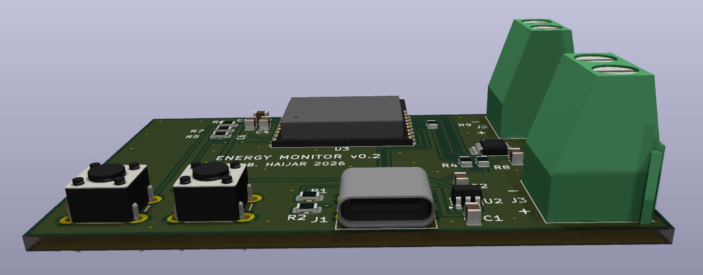
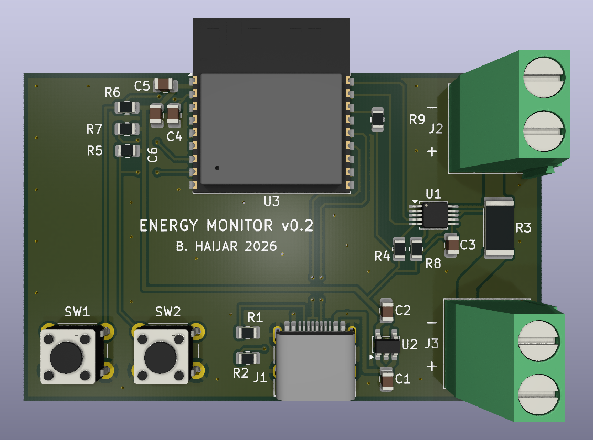
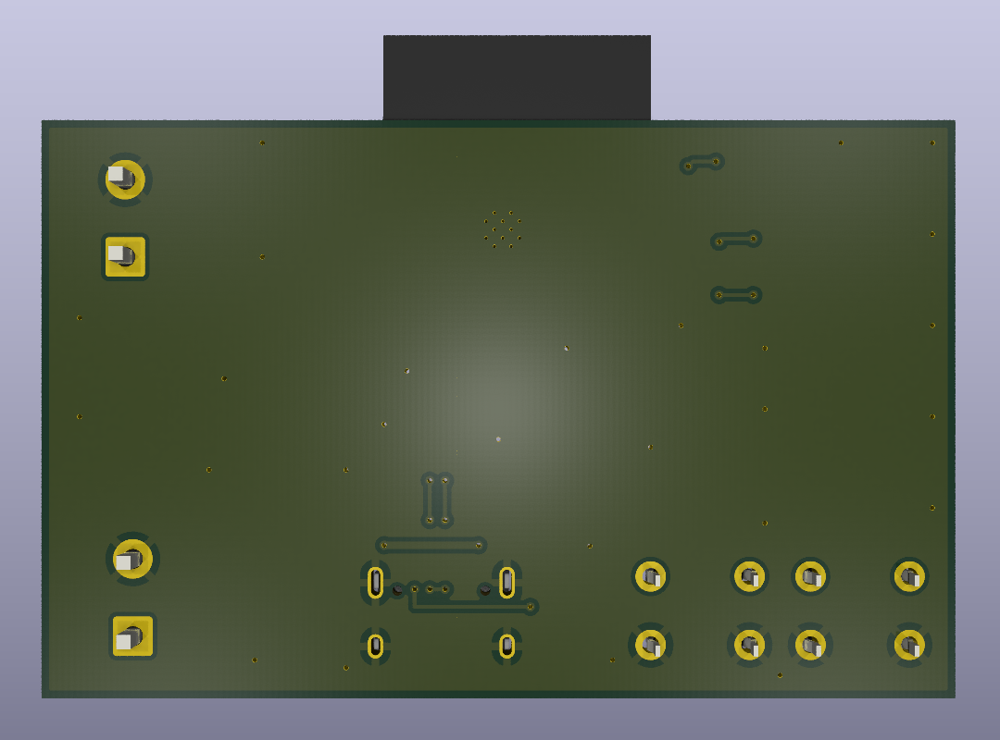

# ESP32-C3 Solar Energy Monitor (PCB)

A 2-layer, 60 × 38 mm board that measures the **voltage, current and power** of a 50 W / 12 V solar panel and reports them over **Wi-Fi**.

> **Status:** designed and checked in KiCad 10 (ERC 0 errors, DRC 0 errors, 0 unconnected). **Not yet fabricated or tested on hardware.** Firmware is not part of this repository yet.



| Top | Bottom |
|---|---|
|  |  |

---

## What it does

The panel's current flows through the board, from **J2 (Solar IN)** to **J3 (Load OUT)**, through a small 20 mΩ shunt resistor. The board works in five steps:

1. **Feed:** 5 V comes in through USB-C (J1). R1/R2 (5.1 kΩ on CC1/CC2) tell the USB source that this is a 5 V sink.
2. **Clean:** an AP2112K-3.3 LDO regulator (U2) makes a steady 3.3 V supply.
3. **Measure:** an INA226 (U1) measures the panel voltage and the current through the 20 mΩ shunt (R3).
4. **Think:** an ESP32-C3-WROOM-02 module (U3) reads the INA226 over I²C (address 0x40) and calculates power.
5. **Send:** the ESP32-C3 sends the readings over Wi-Fi. USB data (D+/D−) goes to the ESP32-C3's native USB for programming.

## Key numbers

| Item | Value |
|---|---|
| Target panel | 50 W, 12 V (Imp 2.84 A, Isc 3.13 A, Voc 20.8 V) |
| Shunt | 20 mΩ, 2512, 1 %, 2 W, Kelvin-connected |
| Max measurable current | 81.92 mV ÷ 0.02 Ω ≈ **4.1 A** (INA226 full-scale shunt voltage) |
| Shunt power at 4.1 A | 4.1² × 0.02 ≈ 0.34 W (well below the 2 W rating) |
| Logic supply | 5 V USB-C → 3.3 V (AP2112K, 600 mA max) |
| Board | 2 layers, 1.6 mm, 60 × 38 mm |

## Design decisions

- **Trace widths by net class** (IPC-2221): signals 0.25 mm, power (VBUS, +3V3) 0.5 mm, high current (PV_IN, LOAD_OUT) 2.1 mm for ~4 A.
- **Kelvin sensing:** the INA226 sense traces leave from the inner edges of the shunt pads, so the high current does not flow through the measurement traces.
- **Ground:** ground pours on both layers, joined by stitching vias, so every return current has a short path home.
- **Decoupling:** 100 nF + 10 µF placed at the ESP32-C3 3V3 pin (smallest capacitor closest), 100 nF at the INA226, 1 µF at the LDO input and output.
- **Antenna:** the ESP32-C3 antenna overhangs the board edge with no copper underneath, following Espressif's layout guidelines.
- **Boot and reset:** RESET (EN) with an RC start-up delay (10 kΩ + 1 µF), a BOOT button on IO9, and pull-ups on the strapping pins IO2/IO8/IO9.
- **Manufacturing:** checked against JLCPCB's capabilities (0.2 mm clearance, 0.3 mm vias, 0.15 mm silkscreen line width).

## Repository contents

```
hardware/     KiCad 10 project (schematic, PCB, project file)
production/   JLCPCB-ready files: Gerbers + drill (zip), BOM, CPL (positions)
docs/         Schematic PDF, 3D renders, layout preview
```

- **Schematic (PDF):** [docs/energy-monitor.pdf](docs/energy-monitor.pdf)
- **Gerbers + drill:** [production/energy-monitor_v0.2.zip](production/energy-monitor_v0.2.zip)
- **BOM** (with LCSC part numbers): [production/energy-monitor_v0.2_bom.csv](production/energy-monitor_v0.2_bom.csv)
- **CPL / pick-and-place:** [production/energy-monitor_v0.2_positions.csv](production/energy-monitor_v0.2_positions.csv)

## Bill of materials (summary)

| Ref | Part | LCSC |
|---|---|---|
| U1 | TI INA226AIDGSR (current/power monitor) | C49851 |
| U2 | Diodes AP2112K-3.3TRG1 (3.3 V LDO) | C51118 |
| U3 | Espressif ESP32-C3-WROOM-02-N4 | C2934560 |
| J1 | HRO TYPE-C-31-M-12 (USB-C) | C165948 |
| J2, J3 | Phoenix MKDS 1,5/2-5,08 terminal block | C480516 |
| R3 | 20 mΩ 2512 2 W shunt | C5375423 |
| SW1, SW2 | Omron B3F-1020 tactile switch | C722171 |
| R, C | 0805 passives (see BOM) | — |

## Notes

- The 3D model of the USB-C connector is not included (it is not from the official KiCad library), so J1 appears without a body in the 3D viewer. The PCB and fabrication files are not affected.
- Next steps: order the boards, write the ESP32-C3 firmware (read the INA226, publish over Wi-Fi), and test against a reference meter.

## Tools

KiCad 10 · JLCPCB design rules · Fabrication Toolkit plugin

## License

Hardware design licensed under the **CERN Open Hardware Licence v2 – Permissive** ([CERN-OHL-P-2.0](LICENSE)).

© 2026 Basel Haijar
